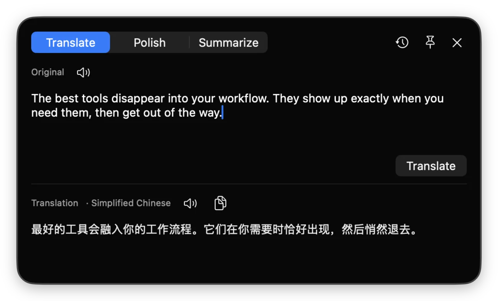

<p align="center">
  
</p>

# Lumo for macOS

Translate, polish, and summarize text anywhere on macOS with your own LLM
provider.

Lumo is a lightweight menu-bar app for everyday text work. Open it with a global
shortcut, paste from the clipboard, or trigger it from
[PopClip](https://pilotmoon.com/popclip/) when you select text in another app.
Results stream into a native macOS window, stay in history, and can be read
aloud.

## What you can do

- **Translate, polish, and summarize** text without opening a chat app.
- **Start from anywhere** with the menu bar, a global shortcut, the clipboard,
  or an optional PopClip action.
- **Bring your own provider**: OpenAI, Anthropic (Claude), or any
  OpenAI-compatible endpoint such as DeepSeek or local Ollama.
- **Keep the workflow native** with streaming output, history, text-to-speech,
  and a menu-bar app that stays out of the Dock.

## Demo

<p align="center">
  
</p>

Lumo can be opened directly from the menu bar, a global shortcut, the clipboard,
or an optional PopClip action.

## Features

- **Three text actions**: translate, polish, and summarize.
- **Multiple ways to start**: menu bar, a configurable global shortcut, an empty
  window that can paste and translate the clipboard with one keystroke, or
  PopClip selection actions.
- **Multiple providers**: OpenAI, Anthropic (Claude), and any
  OpenAI-compatible endpoint (DeepSeek, local Ollama, etc.).
- **Streaming output** via Server-Sent Events — results appear token by token.
- **Smart target language**: detects whether the input is Chinese and picks the
  target language accordingly (both directions are configurable).
- **Translation history** with a master-detail browser.
- **Text-to-speech** for reading results aloud.
- **Menu-bar only** (`LSUIElement`) — no Dock icon, stays out of the way.
- **Automatic updates** via [Sparkle](https://sparkle-project.org) — Lumo checks
  in the background (and on demand from the menu bar) and installs new versions in
  place, so the one-time quarantine clear below never has to be repeated.

## Requirements

- macOS 26.0 or later (the app adopts the Liquid Glass design)
- An API key for your chosen LLM provider
- Optional: [PopClip](https://pilotmoon.com/popclip/) for selection-based
  actions

## Install

### Install the macOS app

Download [**Lumo.zip**](https://github.com/iuhoay/lumo/releases/latest/download/Lumo.zip),
unzip it, and move `Lumo.app` to `/Applications`. The app is unsigned, so clear
the quarantine flag once before the first launch:

```sh
xattr -dr com.apple.quarantine /Applications/Lumo.app
```

On first launch it runs as a menu-bar item — look for it in the status bar, not
the Dock.

From then on Lumo keeps itself up to date: it checks in the background, and you
can trigger a check yourself from the menu bar via **检查更新…**. Updates are
verified by signature and installed in place without re-triggering quarantine —
so you only ever run the `xattr` command this one time.

## Configure

Open the app from its menu-bar item and set, in **Settings**:

| Setting           | Notes                                                            |
| ----------------- | --------------------------------------------------------------- |
| Provider          | OpenAI, Anthropic, or OpenAI-compatible                          |
| Base URL          | Defaults per provider (e.g. `https://api.deepseek.com`)          |
| Model             | e.g. an OpenAI / Claude / DeepSeek model name                    |
| API key           | Stored per provider                                              |
| Target (from 中文) | Language to translate **into** when the input is Chinese         |
| Target (other)    | Language to translate **into** when the input is not Chinese     |
| Shortcut          | Optional global hotkey for opening a new translation window      |

> **Note on the API key:** because the app is unsigned, it stores the API key in
> its own `UserDefaults` (plaintext) rather than the Keychain — an unsigned
> binary has no stable code identity for the Keychain to bind an "Always Allow"
> grant to, so the Keychain would prompt on every launch. This is the accepted
> trade-off for a local personal tool. The key is **not** stored in the PopClip
> extension.

## Use

Use Lumo in whichever way fits the text you are working with:

- **From the menu bar**: open a new translation window, paste or type text, then
  run translate, polish, or summarize.
- **From a global shortcut**: assign a shortcut in Settings and open Lumo from
  any app.
- **From the clipboard**: open an empty translation window and press <kbd>Tab</kbd>
  when the clipboard contains text.
- **From PopClip**: select text anywhere, then click **翻译**, **润色**, or
  **总结** in the PopClip bar.

The result streams into the window and is saved to history.

## Optional integrations

### PopClip

If you use [PopClip](https://pilotmoon.com/popclip/), install
[`Lumo.popclipext`](https://github.com/iuhoay/lumo/tree/main/Lumo.popclipext)
to send selected text to Lumo in one click. The extension is only a trigger; the
native app still handles the provider, API key, model, streaming result, and
history.

## Development

### Repository layout

```
Lumo.popclipext/       PopClip extension (trigger only)
  Config.json          Extension manifest + the "App URL Scheme" option
  translate.js         Builds the lumo:// URL for each action
mac-app/               Native macOS app (Swift, SwiftUI + AppKit)
  project.yml          XcodeGen project spec
  Lumo/                App sources (models, services, views, URL routing)
```

### Build from source

Building from source requires [XcodeGen](https://github.com/yonaskolb/XcodeGen)
and Xcode 26 or later. The Xcode project is generated from `project.yml` (it is
not committed). From `mac-app/`:

```sh
brew install xcodegen        # if you don't have it
cd mac-app
xcodegen generate            # creates Lumo.xcodeproj
open Lumo.xcodeproj          # then build & run the "Lumo" scheme in Xcode
```

### Dev vs. production builds

The project defines two coexisting build configurations so a dev build doesn't
clobber the release one:

| Config  | Bundle ID            | App name   | URL scheme  |
| ------- | -------------------- | ---------- | ----------- |
| Release | `com.iuhoay.lumo`    | Lumo       | `lumo://`   |
| Debug   | `com.iuhoay.lumo.dev`| Lumo Dev   | `lumo-dev://`|

Distinct bundle IDs and URL schemes keep their settings isolated and prevent
LaunchServices from routing the scheme to the wrong build. Point the PopClip
extension at a build with its **App URL Scheme** option (`lumo` or `lumo-dev`).

## License

[MIT](LICENSE) © iuhoay
