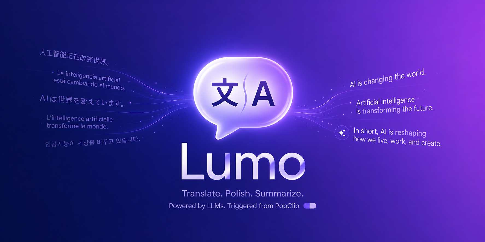

<p align="center">
  
</p>

# Lumo

Translate, polish, and summarize any selected text on macOS with an LLM —
triggered straight from [PopClip](https://pilotmoon.com/popclip/).

Lumo is a two-component system:

1. **PopClip extension** (`Lumo.popclipext/`) — a thin trigger. When you select
   text and click an action, it hands the text to the native app via a custom
   `lumo://` URL scheme. It contains no LLM logic itself.
2. **Native macOS app** (`mac-app/`) — a menu-bar app that does the real work:
   talks to the LLM provider, streams the result, shows it in a window, keeps a
   history, and can read it aloud.

This split exists because PopClip's JavaScript sandbox can't open a real,
persistent window or make arbitrary network calls comfortably — so the
extension delegates everything to the app.

## Demo

<p align="center">
  
</p>

## Features

- **Three actions** on any selection: 翻译 (translate), 润色 (polish),
  总结 (summarize).
- **Multiple providers**: OpenAI, Anthropic (Claude), and any
  OpenAI-compatible endpoint (DeepSeek, local Ollama, etc.).
- **Streaming output** via Server-Sent Events — results appear token by token.
- **Smart target language**: detects whether the input is Chinese and picks the
  target language accordingly (both directions are configurable).
- **Translation history** with a master-detail browser.
- **Text-to-speech** for reading results aloud.
- **Menu-bar only** (`LSUIElement`) — no Dock icon, stays out of the way.

## Repository layout

```
Lumo.popclipext/       PopClip extension (trigger only)
  Config.json          Extension manifest + the "App URL Scheme" option
  translate.js         Builds the lumo:// URL for each action
mac-app/               Native macOS app (Swift, SwiftUI + AppKit)
  project.yml          XcodeGen project spec
  Lumo/                App sources (models, services, views, URL routing)
```

## Requirements

- macOS 14.0 or later
- [PopClip](https://pilotmoon.com/popclip/)
- [XcodeGen](https://github.com/yonaskolb/XcodeGen) and Xcode (to build the app)
- An API key for your chosen LLM provider

## Install

### 1. Build the macOS app

The Xcode project is generated from `project.yml` (it is not committed). From
`mac-app/`:

```sh
brew install xcodegen        # if you don't have it
cd mac-app
xcodegen generate            # creates Lumo.xcodeproj
open Lumo.xcodeproj          # then build & run the "Lumo" scheme in Xcode
```

The app builds unsigned for local/personal use. On first launch it runs as a
menu-bar item (look for it in the status bar, not the Dock).

### 2. Install the PopClip extension

Double-click `Lumo.popclipext` to install it into PopClip, then enable it in
PopClip's preferences.

## Configure

Open the app from its menu-bar item and set, in **Settings**:

| Setting           | Notes                                                            |
| ----------------- | --------------------------------------------------------------- |
| Provider          | OpenAI, Anthropic, or OpenAI-compatible                          |
| Base URL          | Defaults per provider (e.g. `https://api.deepseek.com`)          |
| Model             | e.g. an OpenAI / Claude / DeepSeek model name                    |
| API key           | Stored per provider                                              |
| Target (from 中文) | Language to translate **into** when the input is Chinese         |
| Target (other)    | Language to translate **into** when the input is not Chinese     |

> **Note on the API key:** because the app is unsigned, it stores the API key in
> its own `UserDefaults` (plaintext) rather than the Keychain — an unsigned
> binary has no stable code identity for the Keychain to bind an "Always Allow"
> grant to, so the Keychain would prompt on every launch. This is the accepted
> trade-off for a local personal tool. The key is **not** stored in the PopClip
> extension.

## Use

Select text anywhere, then click **翻译**, **润色**, or **总结** in the PopClip
bar. The app opens with the streamed result, which is also added to history.

## Dev vs. production builds

The project defines two coexisting build configurations so a dev build doesn't
clobber the release one:

| Config  | Bundle ID            | App name   | URL scheme  |
| ------- | -------------------- | ---------- | ----------- |
| Release | `com.iuhoay.lumo`    | Lumo       | `lumo://`   |
| Debug   | `com.iuhoay.lumo.dev`| Lumo Dev   | `lumo-dev://`|

Distinct bundle IDs and URL schemes keep their settings isolated and prevent
LaunchServices from routing the scheme to the wrong build. Point the PopClip
extension at a build with its **App URL Scheme** option (`lumo` or `lumo-dev`).

## License

[MIT](LICENSE) © iuhoay
